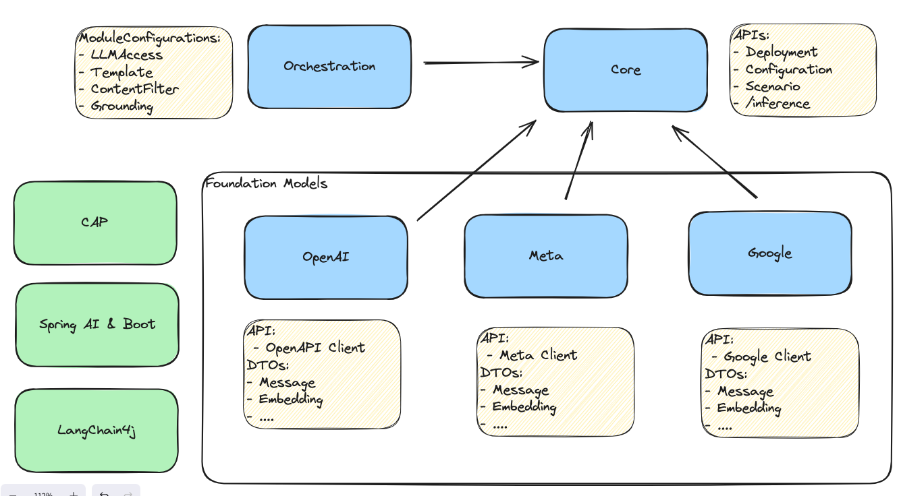

# Module Structure of the SAP AI SDK

Status: Draft

## Module Structure

* `com.sap.ai.sdk:sdk-parent`
  * Root module for the project, not intended for usage in other projects
* `com.sap.ai.sdk:core`
  * Contains the API and model classes for the AI Core API
  * Includes an API for executing arbitrary inference calls
  * Includes potential convenience / utility functions e.g. for getting a destination
* `com.sap.ai.sdk.foundationmodels` contains foundation models grouped by vendor
  * `:openai` (GPT and ADA)
  * `:google` (Gemini and Gecko)
  * `:meta` (LLama)
  * `:anthropic` (?)
  * ...
* `com.sap.ai.sdk:orchestration`
  * Contains the API and model classes for the Orchestration Service
  * Includes API for all orchestration modules
  * Includes OpenAI-style DTOs
* Potentially further modules for integration with frameworks
  * `com.sap.ai.sdk:cap-...`
  * `com.sap.ai.sdk:spring-...`
  * `com.sap.ai.sdk:langchain4j-...`
  
All Java package names are equal to their maven module group id.

## Some Open Questions and Trade-offs

* How should we group foundation models?
  1. (current) By vendor/developer (OpenAI, Google, Meta,..)
  2. By vendor/developer and model type (OpenAI-Chat, OpenAI-Embeddings, ...)
  3. By hosting platform (GCP, Azure, AWS, ...)
* How do we integrate frameworks, considering we have separate modules per foundation model vendor?
  1. Create individual modules `spring-openai`, `spring-google`, `langchain-openai`, `langchain-google` etc.
  2. Make framework integration part of the vendor module and declare the dependency as `optional`
* Should we re-use the `openai` module for `orchestration`
  * Pro: The API is similar and intended to be kept similar
  * Con: OpenAPI has more functionality that might not be supported by the Orchestration API
  * Current proposal: Keep them separate
* Should we have the generated AI Core client in a separate module that is not referenced by `foundationmodels`?
  * Pro: GenAI users get rid of 200+ classes we don't need
  * Con: We need it as soon as we need to do any requests to AI API as part of GenAI calls ( e.g. to offer convenience such as discovering the deployment ID)
    * Also, core is almost empty otherwise, what exactly should go in it?
  * Current proposal: `core` contains the generated client
* All names are subject to change